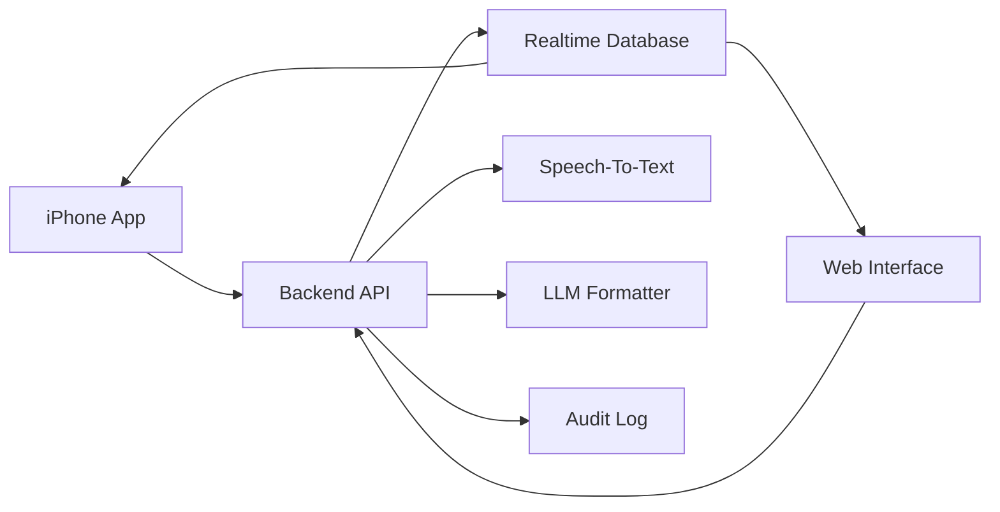

# Architecture

## Components

## Recommended MVP Stack

- iPhone: SwiftUI.
- Web: Next.js or React.
- Backend: FastAPI or Node.js.
- Realtime sync: Supabase or Firebase.
- Speech-to-text: Apple Speech framework initially, with optional server transcription later.
- LLM: OpenAI API or compatible model endpoint.
- Auth: single-user local auth first, then proper identity provider.

## Data Model

### ReportSession

- id
- user_id
- status: active, paused, finalized, archived
- study_type
- accession_label optional
- created_at
- updated_at

### TranscriptSegment

- id
- session_id
- text
- source: iphone, web
- started_at
- ended_at
- sequence
- confidence optional

### ReportDraft

- id
- session_id
- template_id
- findings_text
- impression_text
- full_text
- revision
- generated_from_segment_sequence
- created_at

### QualityFlag

- id
- session_id
- severity: info, warning, critical
- category: ambiguity, contradiction, missing_measurement, laterality, unsupported_claim
- message
- linked_text optional
- resolved_at optional

### Template

- id
- name
- modality
- body_region
- sections
- default_normals
- style_rules
- impression_rules

## Sync Model

The transcript is append-only during dictation. Report drafts are versioned. The web client subscribes to session changes and always shows the latest draft, with access to previous revisions.

## LLM Boundary

The LLM receives structured context:

- selected template
- raw transcript segments since last revision
- existing draft
- user phrase preferences
- safety constraints

The LLM returns structured JSON:

- findings
- impression
- unresolved_questions
- quality_flags
- unsupported_claims

The backend validates the response before saving it.

